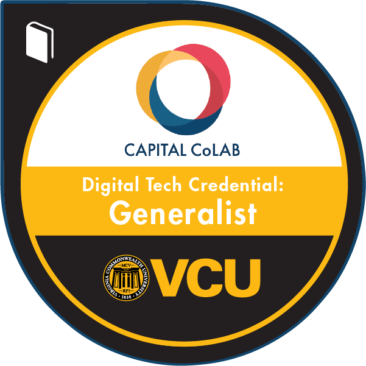

# Welcome to VCU's CMSC 330: Data Science Skills

## What are we doing here?
This course is part of the [VCU Fundamentals of Computing](https://egr.vcu.edu/departments/computer/academics/undergraduate/cs-fundamentals/) certificate and is also part of the Capital CoLAB Digital Technology Generalist Credential, a digital badge that can be posted to LinkedIn and added to your resume. This credential gives students exclusive hiring advantages with companies in the Capital Region. [Learn more about this credential](https://greaterwashingtonpartnership.com/event/capital-colab-101-session/) and which companies offer exclusive internship and hiring advantages.

## What are we going to learn?
The topic of this course is all about getting comfortable manipulating data in Python including foundational skills in data cleaning, data exploration, data visualization, and data analytics. 

## What are we NOT going to learn?
Since this is an introduction to data, we have to build up out foundational skills first before diving into advanced topics like complex machine learning models. At the end of the semester, we'll just start to dip our toes into analytics when we cover regression analysis in Lab 9. 

Data is an entire industry and academic discipline, so there are tons of fascinating topics to explore beyond this course including:
- Data Mining
- Data Engineering
- Deep Learning and Neural Networks
- Reinforcement Learning
- Ethics in Data and AI
- How data practices are applied in every field!

## Why Python?
Python is largely becoming the Lingua Franca for data science because it's easier to pick up and read than many other programming languages, but it's also extemely powerful because there are so many libraries that make data manipulation easy. See some more [detail here](geeksforgeeks.org/python-for-data-science/)

## Why are we on GitHub?
This course has gone through a few iterations, but at the end of the day, we want to make this content as widely available as possible while helping you learn how to use the coding practices you're learning on your own machine. That way you can always reference back to your code when you find a new fascinating dataset to explore.

Bonus points if you can become comfortable using git and GitHub through the process since knowing this will give you a huge experience boost on any future technical opportunities.

## How do I get started?
When you're ready to get started, hop over to the [GettingStarted.md](./GettingStarted.md) file that will walk you through setting up your local environment. If you ever see a term you don't know or need extra guidance, be sure to check the [TermsAndResources.md](./TermsAndResources.md) file. If you can't find the resource to answer your question, reach out to me directly at byramag@vcu.edu.